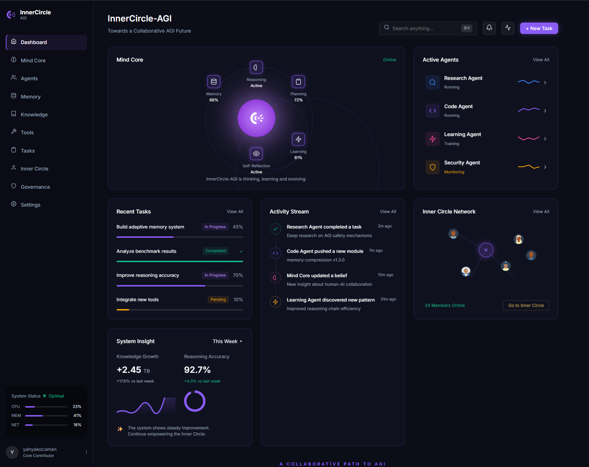

# InnerCircle AGI

> **"Tek bir yapay zeka değil, senin adına düşünen ve her alanda uzman olan bir konsey."**

<div align="center">
  
</div>

InnerCircle AGI, hayatınızın farklı alanlarına odaklanan, her biri kendi uzmanlığına sahip 6 ayrı yapay zeka ajanından oluşan kapalı ve özel bir "Danışma Kurulu"dur. Amacı, size sıradan chatbotlar gibi "şu kodu yaz, şu çeviriyi yap" demek yerine; hayatınızın gidişatı, yatırımlarınız, sağlığınız ve kariyeriniz hakkında **derin, veri odaklı ve proaktif (siz sormadan da düşünen)** akıl hocalığı yapmaktır.

**Projenin temel felsefesi şudur:** Sistemin hiçbir üyesi sizin hayatınıza müdahale etmez veya size kararlar dayatmaz. Yalnızca beklenmedik bağlantılar kurar, size farklı ve ufuk açıcı bir perspektif sunar.

---

## 1. Konseyin Üyeleri Kimlerdir?

İçeride, yazdığınız metni analiz edip en uygun olanın cevapladığı şu 6 uzman bulunur:

| Ajan | Alan | Detaylı Uzmanlık |
|------|------|------------------|
| 🧭 **Yaşam Koçu** | Anlam & Büyüme | Sizin amaçlarınızı, anlam arayışınızı, motivasyonunuzu ve alışkanlıklarınızı inşa eder (CBT veya stoacı felsefe temellerini kullanır). |
| 📈 **Yatırım & Finans** | Servet Gelişimi | Paranızı nasıl koruyacağınızı, makroekonomik gelişmeleri ve risk analizini masaya yatırır. |
| ⚡ **Performans Koçu** | Fiziksel Durum | Uyku düzeniniz, fiziksel gücünüz ve antrenman biliminizle (recovery, HRV) ilgilenir. |
| 🚀 **Kariyer Stratejisti** | Profesyonel Öz | Odak noktası maaşınız değil, "kariyer kapitaliniz" ve güç dinamikleridir. Nasıl daha değerli bir marka olacağınızı tartışır. |
| 🧬 **Sağlık & Zihin Mimarı** | Biyolojik Zirve | Uzun yaşama (longevity), biyolojik saatiniz ve nörolojik potansiyelinize odaklanır. |
| 🔮 **Sentezci** | Sistemik Pano | Ajanlar arası köprüdür. *"Kötü uykunuz (Sağlık), kariyer gerginliğinizi (Kariyer) nasıl etkiliyor?"* gibi büyük resmi okur. |

---

## 2. Arka Planda Nasıl Çalışır? (Teknik Altyapı)

Bu sistem basit bir "ChatGPT kopyası" değildir. Katmanlı ve zekice tasarlanmış bir mimarisi vardır:

- **Yapay Zeka Motoru (OpenAI GPT-4o-mini):** Proje, OpenAI'ın güçlü GPT-4o-mini modelini kullanır. Bu model, hızlı ve yüksek kaliteli yanıtlar üretir. SSE (Server-Sent Events) ile gerçek zamanlı token streaming destekler.
- **Orkestra Şefi (LangGraph):** Siz *"Borsada çok stres yapıyorum, uykularım kaçıyor"* dediğinizde, LangGraph sistemi bu cümleyi anlar ve hem Yatırım ajanına hem de Performans/Sağlık ajanına yönlendirerek ortak bir akıl üretir.
- **Hafıza (ChromaDB):** Sizin daha önce yaptığınız tüm sohbetleri, koyduğunuz hedefleri kaydeder ve unutmaz. Ajanlarla konuştuğunuzda "Geçen ay spor hedefine odaklanmayı seçmiştik, nasıl gidiyor?" diyebilirler.
- **Arka Plan Zekası (Celery):** Uygulamayı kapatsanız bile, Celery adı verilen arka plan işçileri sizin hafızanızı analiz etmeye devam eder ve günde 1-2 defa cebinize "Düşündürücü ve derin bir içgörü (Insight)" bırakır.

---

## 3. Proje Nerelerde Kullanılabilir?

Bu proje, güvenli bir API anahtarı ile çalıştığı için verileriniz gizlidir. Bu sayede bu sistemi:
1. Kendi **kişisel asistanınız / yaşam koçunuz** olarak kullanabilir,
2. Bunu bir **SaaS (Abonelikli Yazılım)** ürününe dönüştürüp, "Profesyonellere Özel AI Konseyi" adıyla internet üzerinden diğer insanlara satabilir,
3. Veya kurumsal şirketlerin **Yönetim Kurulu Danışmanı** olarak pazarlayabilirsiniz.

---

## 👨‍💻 Proje Geliştiricileri

*Bu proje, aşağıdaki ekip üyeleri tarafından tasarlanmış ve geliştirilmiştir:*

- **Yahya Kocaman** — `B2180.060025` — *Proje Lideri & Backend Mimarisi*
- **Onur Balcı** — `B2180.060043` — *AI Agent Sistemi & LangGraph Orkestrasyon*
- **Erdem Bakırcı** — `B2180.060051` — *Frontend SPA & UI/UX Tasarımı*
- **Tolga Ertunç** — `B2280.060052` — *DevOps, Docker & CI/CD Pipeline*
- **Baran Karabulut** — `B2280.060033` — *Veritabanı, ChromaDB & Test Mühendisliği*
- **Mustafa Buğra Boz** — `B2180.060028` — *Güvenlik, Monitoring & Dokümantasyon*

---

## 🛠 Mimari & Teknoloji Yığını

```
┌──────────────────────────────────────────────────────────────┐
│                    InnerCircle AGI                           │
├──────────────┬───────────────────────────────────────────────┤
│  Frontend    │  FastAPI App (Docker)                         │
│  HTML/CSS/JS │                                               │
│  • SPA       │  ┌──────────┐  ┌──────────┐  ┌───────────┐  │
│  • SSE Stream│  │ LangGraph│  │ChromaDB  │  │Prometheus │  │
│  • Auth SPA  │  │ Router   │  │Vector DB │  │ Metrics   │  │
└──────────────┴──┤          ├──┤          ├──┤           ├──┘
                  └────┬─────┘  └──────────┘  └───────────┘
                       │
              ┌────────┼────────┐
              │        │        │
          Life Coach  Career  Health  ...
              │
         ┌────┴────┐
         │ OpenAI  │ GPT-4o-mini
         └─────────┘
              │
     ┌────────┴────────┐
     │   Celery/Redis  │
     │ Background Jobs │
     └─────────────────┘
```

| Katman | Teknoloji |
|--------|-----------|
| **Web Framework** | FastAPI + uvicorn |
| **AI Model** | OpenAI GPT-4o-mini (cloud API) |
| **Agent Orchestration** | LangGraph multi-agent swarm |
| **Vector Memory** | ChromaDB (per-agent collections) |
| **Persistence** | PostgreSQL 16 |
| **Background Tasks** | Celery + Redis |
| **Observability** | Prometheus + Grafana |
| **Auth** | JWT (HS256) + bcrypt |
| **CI/CD** | GitHub Actions + GHCR |
| **Containerization** | Docker + Docker Compose |

---

## 🚀 Hızlı Başlangıç

### Ön Koşullar

- Docker & Docker Compose
- OpenAI API Anahtarı ([https://platform.openai.com/api-keys](https://platform.openai.com/api-keys))

### 1. Projeyi Başlat

```bash
# Repoyu klonla
git clone https://github.com/yahyaKocaman/InnerCircle-AGI
cd InnerCircle-AGI

# .env dosyası oluştur
cp .env.example .env
# OPENAI_API_KEY ve SECRET_KEY'i değiştir!

# Servisleri başlat
make up
# veya: docker compose up -d --build
```

### 2. Uygulamayı Kullan

| Erişim | URL |
|--------|---------| 
| **Ana uygulama (SPA)** | http://localhost:8000 |
| **OpenAPI dokümantasyonu** | http://localhost:8000/api/docs |
| **Prometheus metrikleri** | http://localhost:8000/metrics |
| **Sağlık kontrolü** | http://localhost:8000/health |

---

## ⚙️ Yapılandırma (Make Komutları)

Komut satırınızda projeyi kolayca yönetebilirsiniz:

```bash
make up              # Tüm servisleri başlat
make up-monitoring   # + Prometheus & Grafana ile başlat
make down            # İmajları durdur
make logs            # Tüm anlık logları takip et
make logs-app        # Sadece API tarafındaki logları göster
make test            # Yazılım testlerini çalıştır
make lint            # Kod kalite kontrolü
```

---

## 📊 Monitoring (Gözlem & İstatistik)

Projeyi detaylı grafiklerle takip etmek için:

```bash
make up-monitoring
```

| Servis | URL | Kullanıcı Girişi |
|--------|-----|-------------|
| **Prometheus** | http://localhost:9090 | *Yok* |
| **Grafana** | http://localhost:3000 | `admin` / `innercircle` |

---

## 📂 Proje Dizin Yapısı

```
InnerCircle-AGI/
├── app/
│   ├── agents/           # 6 konsey ajanı ve yönlendirici (orchestrator)
│   │   ├── base_agent.py # Template Method Pattern — taban sınıf
│   │   ├── council.py    # LangGraph router + Strategy Pattern
│   │   ├── life_coach.py
│   │   ├── investment.py
│   │   └── ... 
│   ├── api/              # RESTful API Endpoint'leri (MVC Controller)
│   ├── core/             # Güvenlik, limitler ve konfigürasyonlar
│   ├── domain/           # Veritabanı Modelleri ve Pydantic Şemaları (MVC Model)
│   ├── infrastructure/   # OpenAI ve ChromaDB veritabanı sürücüleri
│   ├── static/           # SPA Frontend dosyaları (MVC View)
│   └── tasks/            # Celery arka plan işlem görevleri
├── docs/                 # Akademik dokümantasyon
│   ├── DESIGN_PATTERNS.md
│   ├── PROJECT_MANAGEMENT.md
│   └── SPECIAL_TOPICS.md
├── monitoring/
│   ├── prometheus.yml
│   └── grafana/          # Grafana sistem panelleri (Dashboards)
├── tests/                # Birim testleri (pytest)
├── .github/workflows/    # CI (Lint+Test) ve CD (GHCR Push) Otomasyonu
├── Dockerfile            # Multi-stage Docker yapısı
└── docker-compose.yml    
```

---

## 🔒 Güvenlik Altyapısı

- **JWT HS256** ile şifrelenmiş kimlik doğrulama.
- **bcrypt** algoritmasıyla şifre kriptolama.
- **SlowAPI** ile Rate limiting (DDoS ve spam koruması).
- Tüm sayfalara uygulanan çok katmanlı **OWASP HTTP security headers**.
- **Non-root Docker user** izolasyonu.
