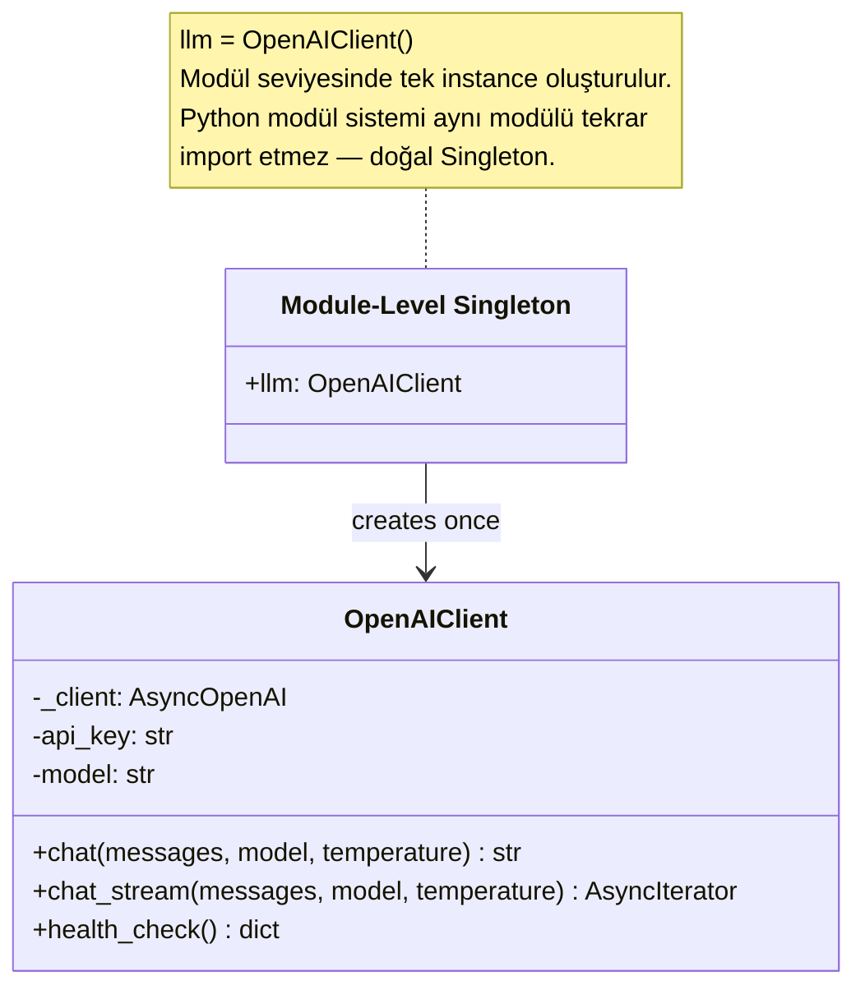
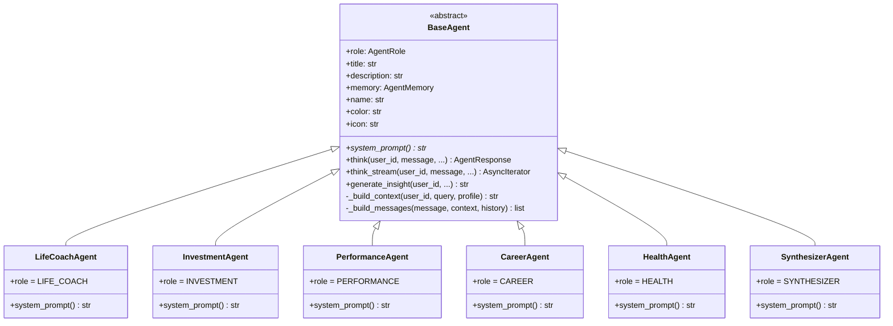
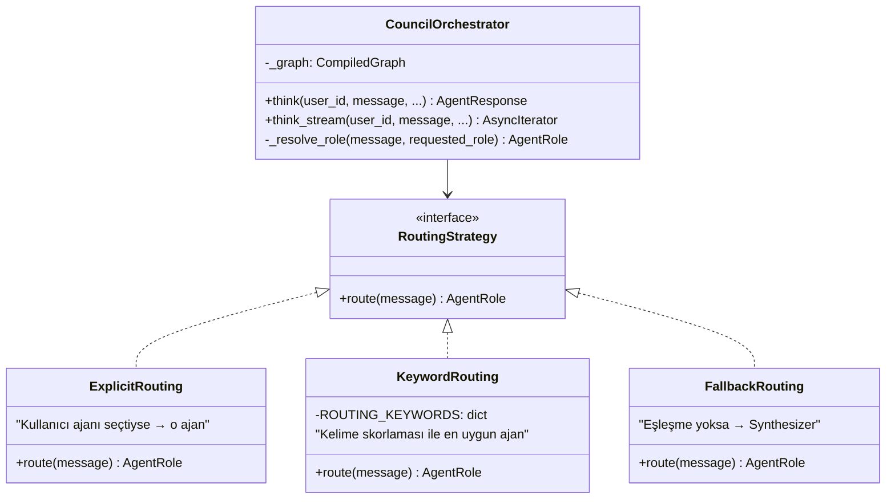
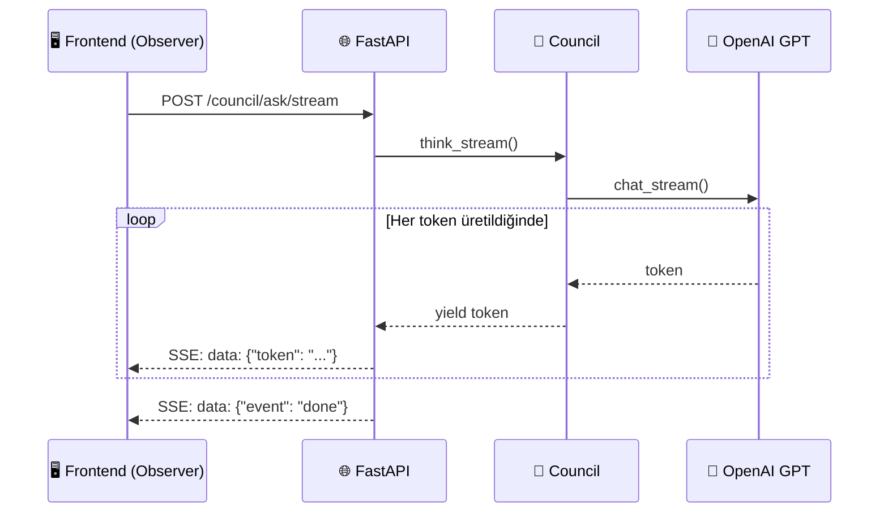
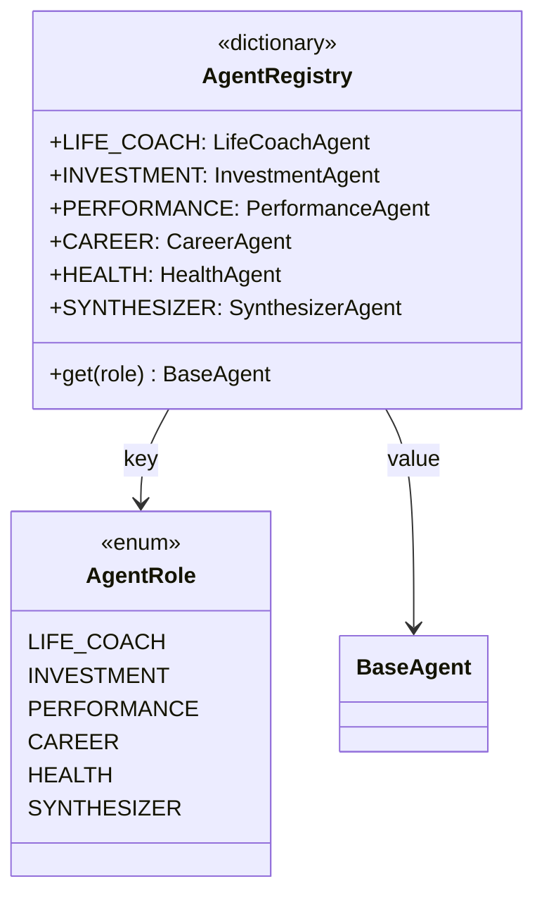
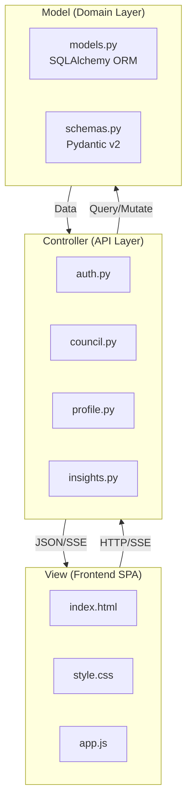

# UYG220 — Yazılım Tasarım Kalıpları (Design Patterns)

## InnerCircle AGI Projesi — Tasarım Kalıpları Raporu

> Bu dokümanda InnerCircle AGI projesinde kullanılan yazılım tasarım kalıpları, her birinin neden seçildiği, nerede uygulandığı ve UML diyagramları ile açıklanmaktadır.

---

## 1. Singleton Pattern (Tekil Kalıp)

### Neden Kullanıldı?
Singleton pattern, uygulamanın yaşam döngüsü boyunca yalnızca **bir tek örnek (instance)** oluşturulması gereken nesnelerde kullanılır. Birden fazla bağlantı oluşturmak kaynak israfına ve tutarsızlığa yol açar.

### Nerede Kullanıldı?

| Dosya | Satır | Singleton Nesnesi | Amaç |
|-------|-------|-------------------|------|
| `app/infrastructure/openai_client.py` | L:149 | `llm = OpenAIClient()` | Tek OpenAI API bağlantısı |
| `app/agents/council.py` | L:230 | `council = CouncilOrchestrator()` | Tek LangGraph graf instance |
| `app/infrastructure/chroma_client.py` | L:20-31 | `_chroma_client` (lazy init) | Tek ChromaDB bağlantısı |
| `app/core/config.py` | L:45-50 | `settings = get_settings()` | `@lru_cache` ile tek konfigürasyon |

### UML Diyagramı



### Kod Örneği

```python
# app/infrastructure/openai_client.py — Satır 149
# ── Singleton ─────────────────────────────────────────────────
llm = OpenAIClient()

# app/core/config.py — @lru_cache ile Singleton
@lru_cache()
def get_settings() -> Settings:
    return Settings()

settings = get_settings()
```

---

## 2. Template Method Pattern (Şablon Yöntem Kalıbı)

### Neden Kullanıldı?
Template Method, bir algoritmanın iskeletini üst sınıfta tanımlayıp, belirli adımları alt sınıflara bırakmak için kullanılır. InnerCircle'da **tüm 6 ajan aynı akışı** izler:

1. Bellek al (retrieve memory)
2. Mesaj dizisi oluştur (build messages)
3. LLM'e gönder (call AI)
4. Belleğe kaydet (store memory)

Ancak her ajan **farklı system prompt** kullanır.

### Nerede Kullanıldı?

| Dosya | Sınıf | Rol |
|-------|-------|-----|
| `app/agents/base_agent.py` | `BaseAgent` (abstract) | Template — iskelet tanımlar |
| `app/agents/life_coach.py` | `LifeCoachAgent` | Concrete — `system_prompt` override |
| `app/agents/investment.py` | `InvestmentAgent` | Concrete — `system_prompt` override |
| `app/agents/performance.py` | `PerformanceAgent` | Concrete — `system_prompt` override |
| `app/agents/career.py` | `CareerAgent` | Concrete — `system_prompt` override |
| `app/agents/health.py` | `HealthAgent` | Concrete — `system_prompt` override |
| `app/agents/synthesizer.py` | `SynthesizerAgent` | Concrete — `system_prompt` override |

### UML Diyagramı



### Kod Örneği

```python
# BaseAgent (Template) — Algoritma iskeleti
class BaseAgent(ABC):
    @property
    @abstractmethod
    def system_prompt(self) -> str:
        """Her alt sınıf kendi uzmanlık promptunu tanımlar."""
        ...

    async def think(self, user_id, message, ...):
        # 1. Bağlam oluştur (sabit adım)
        context = self._build_context(user_id, message, profile_context)
        # 2. Mesaj dizisi oluştur (sabit adım)
        messages = self._build_messages(message, context, history)
        # 3. LLM'e gönder (sabit adım)
        response_text = await llm.chat(messages=messages)
        # 4. Belleğe kaydet (sabit adım)
        self.memory.store(user_id=user_id, content=interaction, ...)

# Concrete Agent — Sadece system_prompt değişir
class LifeCoachAgent(BaseAgent):
    role = AgentRole.LIFE_COACH
    
    @property
    def system_prompt(self) -> str:
        return """Sen InnerCircle AGI konseyi üyesi, Yaşam Koçusun..."""
```

---

## 3. Strategy Pattern (Strateji Kalıbı)

### Neden Kullanıldı?
Strategy pattern, çalışma zamanında farklı algoritmaları seçmek için kullanılır. InnerCircle'da **mesaj yönlendirme (routing)** üç farklı strateji ile yapılır:

1. **Açık istek (explicit):** Kullanıcı belirli bir ajan seçmişse → o ajana git
2. **Anahtar kelime eşleme (keyword):** Mesajdaki kelimeleri analiz et → en yüksek puan alan ajana git
3. **Varsayılan (fallback):** Hiçbir eşleşme yoksa → Sentezci'ye git

### Nerede Kullanıldı?

| Dosya | Fonksiyon | Strateji |
|-------|-----------|----------|
| `app/agents/council.py` | `routing_node()` L:90-114 | 3 strateji birleşik |
| `app/agents/council.py` | `ROUTING_KEYWORDS` L:44-72 | Keyword-per-agent konfigürasyonu |

### UML Diyagramı



### Kod Örneği

```python
def routing_node(state: CouncilState) -> CouncilState:
    # Strateji 1: Açık istek
    if state.get("requested_role"):
        state["resolved_role"] = state["requested_role"]
        return state

    # Strateji 2: Anahtar kelime eşleme
    message_lower = state["message"].lower()
    scores = {role: 0 for role in AgentRole}
    for role, keywords in ROUTING_KEYWORDS.items():
        for kw in keywords:
            if kw in message_lower:
                scores[role] += 1

    best_role = max(scores, key=lambda r: scores[r])
    if scores[best_role] > 0:
        state["resolved_role"] = best_role.value
    else:
        # Strateji 3: Varsayılan (fallback)
        state["resolved_role"] = AgentRole.SYNTHESIZER.value
    
    return state
```

---

## 4. Observer Pattern (Gözlemci Kalıbı) — Pub/Sub

### Neden Kullanıldı?
Observer pattern, bir nesnenin durum değişikliğini birden fazla gözlemciye **otomatik olarak bildirmek** için kullanılır. InnerCircle'da bu iki yerde uygulanır:

1. **SSE Streaming:** AI yanıtı üretilirken her token, gerçek zamanlı olarak istemciye (frontend) gönderilir.
2. **Celery Insight Push:** Arka plan görevleri kullanıcıya proaktif içgörüler üretip bildirim bırakır.

### Nerede Kullanıldı?

| Dosya | Mekanizma | Observer Rolü |
|-------|-----------|---------------|
| `app/api/council.py` L:233-283 | SSE `event_generator()` | Frontend = Observer, AI Stream = Subject |
| `app/tasks/insight_generator.py` | Celery Beat | Insight DB = Subject, User = Observer |

### UML Diyagramı



---

## 5. Registry / Factory Pattern (Kayıt Defteriçi / Fabrika Kalıbı)

### Neden Kullanıldı?
Registry pattern, nesneleri **string anahtar → instance** eşlemesiyle merkezi bir yerden yönetmek için kullanılır. Yeni bir ajan eklemek için sadece registry'ye kayıt yapmak yeterlidir — client kodu değişmez.

### Nerede Kullanıldı?

| Dosya | Değişken | Registry İçeriği |
|-------|----------|-----------------|
| `app/agents/council.py` L:35-42 | `AGENT_REGISTRY` | `AgentRole → BaseAgent` eşlemesi |
| `app/infrastructure/chroma_client.py` L:143-145 | `agent_memories` | `AgentRole → AgentMemory` eşlemesi |

### UML Diyagramı



### Kod Örneği

```python
# app/agents/council.py — Agent Registry
AGENT_REGISTRY = {
    AgentRole.LIFE_COACH:   life_coach,
    AgentRole.INVESTMENT:   investment_agent,
    AgentRole.PERFORMANCE:  performance_agent,
    AgentRole.CAREER:       career_agent,
    AgentRole.HEALTH:       health_agent,
    AgentRole.SYNTHESIZER:  synthesizer_agent,
}

# Kullanım — string key ile ajan çağırma
agent = AGENT_REGISTRY[resolved_role]
response = await agent.think(user_id=user_id, message=message)
```

---

## 6. MVC Pattern (Model-View-Controller)

### Neden Kullanıldı?
MVC, uygulamanın **veri (Model)**, **sunum (View)** ve **iş mantığı (Controller)** katmanlarını birbirinden ayırarak bakımı ve test edilebilirliği kolaylaştırır.

### Nerede Kullanıldı?

| MVC Katmanı | Dosya(lar) | Sorumluluk |
|-------------|-----------|------------|
| **Model** | `app/domain/models.py` | SQLAlchemy ORM modelleri (User, Message, Session, Insight) |
| **Model** | `app/domain/schemas.py` | Pydantic v2 istek/yanıt şemaları |
| **View** | `app/static/index.html` | HTML SPA arayüzü |
| **View** | `app/static/style.css` | CSS tasarım sistemi |
| **View** | `app/static/app.js` | JavaScript SPA logic |
| **Controller** | `app/api/auth.py` | Auth endpoint'leri |
| **Controller** | `app/api/council.py` | Council endpoint'leri |
| **Controller** | `app/api/profile.py` | Profile endpoint'leri |
| **Controller** | `app/api/insights.py` | Insights endpoint'leri |

### UML Diyagramı



---

## Özet Tablosu

| # | Pattern | Dosya | Amaç |
|---|---------|-------|------|
| 1 | **Singleton** | `openai_client.py`, `council.py`, `config.py` | Kaynak havuzlama, tek bağlantı |
| 2 | **Template Method** | `base_agent.py` → 6 concrete agent | Ortak akış, farklı davranış |
| 3 | **Strategy** | `council.py` routing_node | Çalışma zamanı yönlendirme |
| 4 | **Observer** | `council.py` SSE streaming | Gerçek zamanlı token push |
| 5 | **Registry/Factory** | `council.py` AGENT_REGISTRY | Merkezi ajan yönetimi |
| 6 | **MVC** | `domain/` + `api/` + `static/` | Katman ayrımı |
