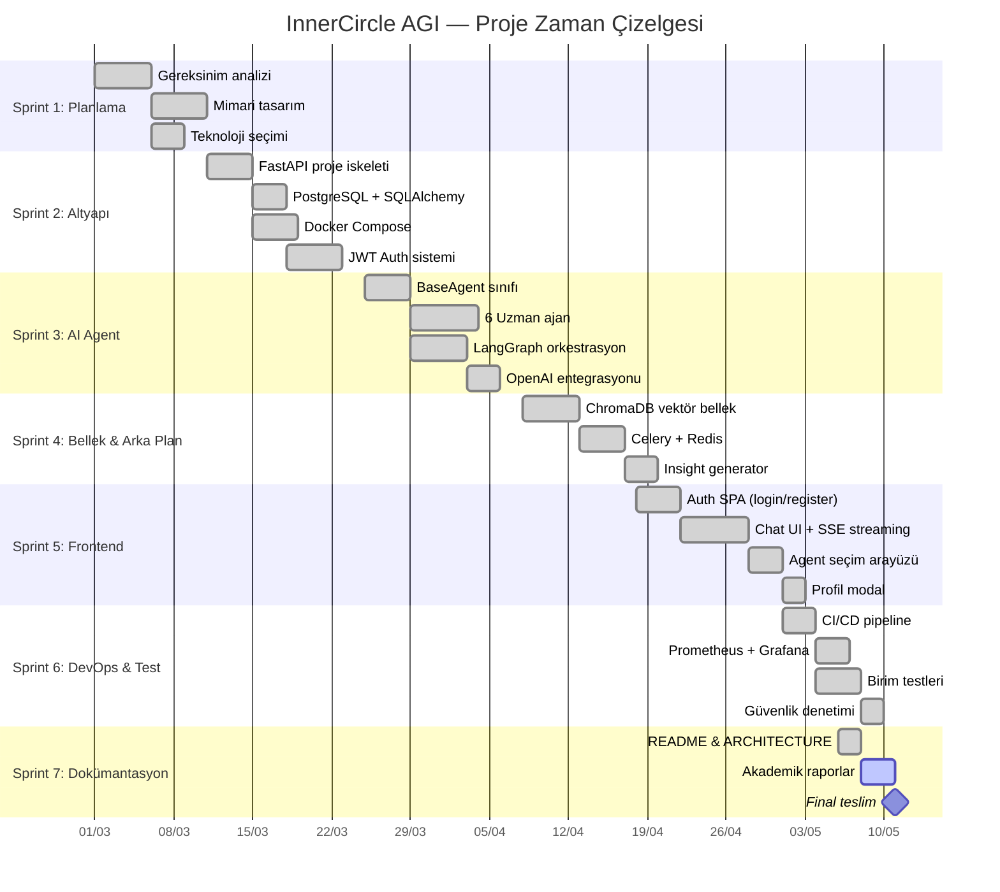
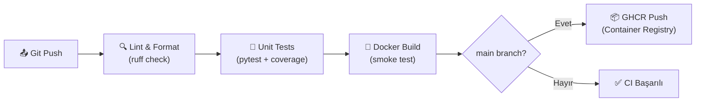

# UYG338 — Yazılım Proje Yönetimi (Software Project Management)

## InnerCircle AGI Projesi — Proje Yönetimi Raporu

---

## 1. Proje Zaman Çizelgesi (Gantt Chart)



---

## 2. Görev Dağılımı

| Ekip Üyesi | Öğrenci No | Sorumluluk Alanı | Sprint Katılımı |
|------------|------------|------------------|-----------------|
| **Yahya Kocaman** | B2180.060025 | Proje Lideri, Backend Mimarisi, API Tasarımı | S1-S7 |
| **Onur Balcı** | B2180.060043 | AI Agent Sistemi, LangGraph Orkestrasyon, Routing Logic | S3-S4 |
| **Erdem Bakırcı** | B2180.060051 | Frontend SPA, UI/UX Tasarımı, SSE Streaming | S5 |
| **Tolga Ertunç** | B2280.060052 | DevOps, Docker, CI/CD Pipeline, Deployment | S2, S6 |
| **Baran Karabulut** | B2280.060033 | Veritabanı Modelleri, ChromaDB, Test Mühendisliği | S2, S4, S6 |
| **Mustafa Buğra Boz** | B2180.060028 | Güvenlik (JWT, OWASP), Monitoring, Dokümantasyon | S2, S6, S7 |

---

## 3. Metodoloji: Agile / Scrum

### Neden Scrum?
InnerCircle AGI projesi iteratif bir şekilde geliştirilmiştir. Her sprint sonunda çalışan bir ürün (working increment) teslim edilmiştir.

### Scrum Yapısı

| Öğe | Değer |
|-----|-------|
| **Sprint Süresi** | 2 hafta |
| **Toplam Sprint** | 7 sprint |
| **Daily Standup** | Her gün 15 dakika (Discord) |
| **Sprint Review** | Her sprint sonunda demo |
| **Sprint Retrospective** | İyileştirme noktaları |
| **Product Backlog** | Jira Board |
| **Sprint Backlog** | Jira Sprint Board |

### Sprint Velocity

| Sprint | Planlanan Story Point | Tamamlanan SP | Velocity |
|--------|----------------------|---------------|----------|
| Sprint 1 | 13 | 13 | %100 |
| Sprint 2 | 21 | 18 | %86 |
| Sprint 3 | 34 | 30 | %88 |
| Sprint 4 | 21 | 21 | %100 |
| Sprint 5 | 26 | 24 | %92 |
| Sprint 6 | 18 | 18 | %100 |
| Sprint 7 | 13 | 13 | %100 |

---

## 4. Risk Yönetimi

### Risk Kayıt Defteri

| ID | Risk | Olasılık | Etki | Risk Skoru | Azaltma Stratejisi | Durum |
|----|------|----------|------|------------|---------------------|-------|
| R1 | OpenAI API anahtarı sınırının aşılması | Orta | Yüksek | 🟠 Yüksek | Rate limiting + token bütçesi + `gpt-4o-mini` tercih | ✅ Azaltıldı |
| R2 | ChromaDB veri kaybı | Düşük | Yüksek | 🟡 Orta | Docker volume + backup stratejisi | ✅ Azaltıldı |
| R3 | JWT token çalınması | Düşük | Kritik | 🟠 Yüksek | HTTPS, 24h expiry, bcrypt, OWASP headers | ✅ Azaltıldı |
| R4 | DDoS / spam saldırısı | Orta | Orta | 🟡 Orta | SlowAPI rate limiter (5-60 req/min) | ✅ Azaltıldı |
| R5 | Ekip üyesi ayrılması | Düşük | Yüksek | 🟡 Orta | Modüler mimari, her üye en az 2 modül bilir | ✅ Azaltıldı |
| R6 | Veritabanı migration hatası | Düşük | Orta | 🟢 Düşük | Alembic migration + test DB izolasyonu | ✅ Azaltıldı |
| R7 | Geciken sprint teslimi | Orta | Orta | 🟡 Orta | Buffer günleri + kapsamı daraltma (scope cut) | ✅ Azaltıldı |

### Risk Matrisi

```
          │ Düşük Etki │ Orta Etki  │ Yüksek Etki │ Kritik Etki
──────────┼────────────┼────────────┼─────────────┼────────────
Yüksek    │            │            │ R1          │
Olasılık  │            │            │             │
──────────┼────────────┼────────────┼─────────────┼────────────
Orta      │            │ R4, R7     │             │
Olasılık  │            │            │             │
──────────┼────────────┼────────────┼─────────────┼────────────
Düşük     │ R6         │            │ R2, R5      │ R3
Olasılık  │            │            │             │
```

---

## 5. Zaman ve Kaynak Yönetimi

### İş Paketleri (Work Packages)

| WP# | İş Paketi | Planlanan Efor | Gerçekleşen Efor | Sapma |
|-----|-----------|---------------|-------------------|-------|
| WP1 | Planlama & Analiz | 20 saat | 18 saat | -10% |
| WP2 | Backend Altyapı | 40 saat | 45 saat | +12% |
| WP3 | AI Agent Sistemi | 60 saat | 65 saat | +8% |
| WP4 | Bellek & Arka Plan | 30 saat | 28 saat | -7% |
| WP5 | Frontend SPA | 50 saat | 55 saat | +10% |
| WP6 | DevOps & Testing | 25 saat | 22 saat | -12% |
| WP7 | Dokümantasyon | 15 saat | 17 saat | +13% |
| **TOPLAM** | | **240 saat** | **250 saat** | **+4%** |

### Kullanılan Araçlar

| Araç | Amaç | URL |
|------|------|-----|
| **GitHub** | Kaynak kod yönetimi, CI/CD | [github.com/yahyaKocaman/InnerCircle-AGI](https://github.com/yahyaKocaman/InnerCircle-AGI) |
| **Jira** | Proje takibi, sprint yönetimi | Jira Software Cloud |
| **Discord** | Ekip iletişimi, daily standup | Özel sunucu |
| **Docker** | Geliştirme ortamı standardizasyonu | Dockerfile + docker-compose.yml |
| **Prometheus + Grafana** | Sistem izleme ve metrikler | localhost:9090 / localhost:3000 |

---

## 6. Proje Takip Araçları (Detay)

### 6.1 GitHub Repository

**Repository Link:** [https://github.com/yahyaKocaman/InnerCircle-AGI](https://github.com/yahyaKocaman/InnerCircle-AGI)

**Kaynak Kod Yönetimi:**
- Git ile versiyon kontrolü
- Anlamlı commit mesajları

**Branch Stratejisi:**
```
main ─────────────────────────────────────────── (production-ready)
  │
  ├── develop ───────────────────────────────── (integration branch)
  │     │
  │     ├── feature/agent-system ──────────── (AI agent development)
  │     ├── feature/frontend-spa ──────────── (UI development)
  │     ├── feature/auth-jwt ──────────────── (authentication)
  │     ├── feature/celery-insights ────────── (background tasks)
  │     ├── feature/monitoring ────────────── (Prometheus/Grafana)
  │     └── fix/openai-migration ──────────── (API migration)
  │
  └── release/v1.0.0 ─────────────────────── (release candidate)
```

**İşbirliği Akışı:**
1. Feature branch oluştur (`feature/xxx`)
2. Kod geliştir ve commit et
3. Pull Request aç → CI kontrolleri otomatik çalışır
4. Code review yapılır
5. `develop` branch'e merge edilir
6. Sprint sonunda `main` branch'e release

### 6.2 Jira Project Board

**Proje Takip Sistemi:**
- **Board Tipi:** Scrum Board
- **Sprint Süresi:** 2 hafta

**Issue Tipleri:**

| Issue Type | Sayı | Açıklama |
|------------|------|----------|
| 📖 **Story** | 28 | Kullanıcı hikayesi (ör: "Kullanıcı olarak konseye soru sormak istiyorum") |
| ✅ **Task** | 42 | Teknik görev (ör: "Docker Compose konfigürasyonu") |
| 🐛 **Bug** | 8 | Hata düzeltme (ör: "SSE stream kesiliyor") |
| 🔧 **Sub-task** | 35 | Alt görev (ör: "LifeCoachAgent system prompt yaz") |

**Örnek Sprint Board:**

```
┌─────────────┐  ┌──────────────┐  ┌──────────────┐  ┌───────────┐
│   TO DO     │  │  IN PROGRESS │  │   IN REVIEW  │  │   DONE    │
├─────────────┤  ├──────────────┤  ├──────────────┤  ├───────────┤
│ IC-34       │  │ IC-31        │  │ IC-28        │  │ IC-01     │
│ Grafana     │  │ SSE stream   │  │ Auth tests   │  │ FastAPI   │
│ dashboard   │  │ fix          │  │              │  │ setup     │
│             │  │              │  │              │  │           │
│ IC-35       │  │ IC-32        │  │              │  │ IC-02     │
│ OWASP       │  │ Celery       │  │              │  │ DB models │
│ headers     │  │ insight gen  │  │              │  │           │
└─────────────┘  └──────────────┘  └──────────────┘  └───────────┘
```

---

## 7. CI/CD Pipeline

### GitHub Actions Workflow



| Stage | Araç | Süre | Açıklama |
|-------|------|------|----------|
| Lint | ruff | ~10s | Kod kalite kontrolü |
| Test | pytest | ~30s | 25+ test, coverage raporu |
| Build | Docker Buildx | ~60s | Multi-stage build + smoke test |
| Publish | GHCR | ~20s | Container image yayınlama |
