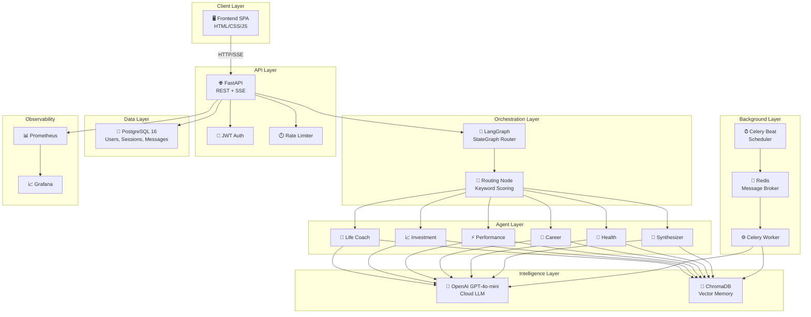
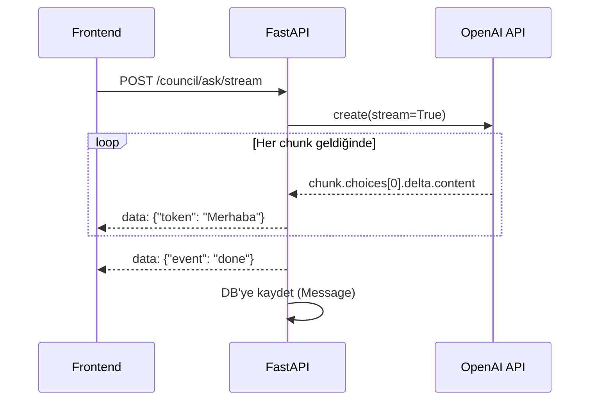
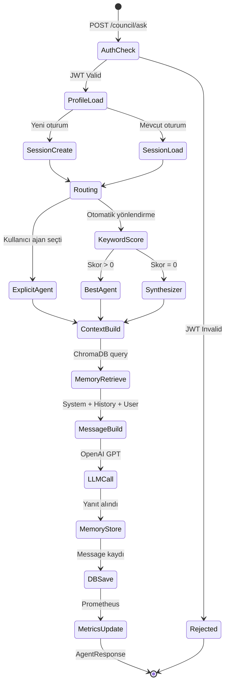
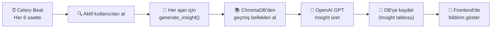

# UYG414 — Yazılım Geliştirmede Özel Konular (Special Topics)

## InnerCircle AGI — AI Multi-Agent Systems & LangGraph Orchestration

**Seçilen Konu:** Yapay Zeka / Multi-Agent Sistemler / RAG Mimarisi

---

## 1. Teknik Açıklama

### 1.1 Multi-Agent Sistem Nedir?

Multi-Agent System (MAS), birden fazla **otonom ajanın** belirli bir hedefe ulaşmak için birbirleriyle etkileşim halinde çalıştığı bir yapay zeka mimarisidir. InnerCircle AGI'de 6 uzman ajan, bir orkestratör (LangGraph) tarafından koordine edilir.

**Geleneksel chatbot vs InnerCircle AGI:**

| Özellik | Geleneksel Chatbot | InnerCircle AGI |
|---------|-------------------|-----------------|
| Ajan sayısı | 1 (tek model) | 6 uzman + 1 sentezci |
| Routing | Yok | LangGraph StateGraph |
| Hafıza | Session-based | ChromaDB vektör bellek (kalıcı) |
| Proaktiflik | Yok | Celery ile insight generation |
| Kişiselleştirme | Genel | Per-user profil bağlamı |

### 1.2 Mimari Genel Bakış



---

## 2. Algoritmalar

### 2.1 Keyword-Based Intent Classification (Niyet Sınıflandırma)

InnerCircle AGI, kullanıcı mesajını analiz ederek hangi ajana yönlendirileceğini belirler. Bu, bir **skor tabanlı sınıflandırma algoritmasıdır.**

**Algoritma Akışı:**

```
Girdi: kullanıcı mesajı M, anahtar kelime sözlüğü K

1. M'yi küçük harfe dönüştür
2. Her ajan rolü R için:
   a. skor[R] = 0
   b. K[R] içindeki her kelime w için:
      eğer w ∈ M ise: skor[R] += 1
3. en_iyi_R = argmax(skor)
4. eğer skor[en_iyi_R] > 0: yönlendir(en_iyi_R)
5. değilse: yönlendir(SYNTHESIZER)
```

**Zaman Karmaşıklığı:** O(A × K × M) — A: ajan sayısı, K: ortalama keyword sayısı, M: mesaj uzunluğu

### 2.2 Cosine Similarity (Kosinüs Benzerliği) — ChromaDB

ChromaDB, her ajan için ayrı bir vektör koleksiyonu tutar. Kullanıcının yeni sorusu ile geçmiş etkileşimler arasındaki benzerlik **cosine similarity** ile hesaplanır.

```
similarity(A, B) = (A · B) / (||A|| × ||B||)
```

- Sonuç 0 ile 1 arasında — 1'e yakın = çok benzer
- Eşik: 0.3 (bu değerin altındaki bellekler filtrelenir)

**Kullanım:**
```python
# base_agent.py — _build_context()
memories = self.memory.retrieve(user_id=user_id, query=query, n_results=5)
# Sadece yüksek benzerlikli bellekleri dahil et
relevant = [m for m in memories if m["score"] > 0.3]
```

### 2.3 SSE (Server-Sent Events) Token Streaming

OpenAI API'nin streaming özelliği ile her token üretildiğinde frontend'e anında gönderilir:



---

## 3. Sistem Workflow

### 3.1 Kullanıcı Sorgusu Yaşam Döngüsü



### 3.2 Proaktif Insight Generation Workflow



---

## 4. Performans Analizi

### 4.1 Prometheus Metrikleri

| Metrik | Tip | Açıklama |
|--------|-----|----------|
| `innercircle_council_queries_total` | Counter | Toplam konsey sorgusu |
| `innercircle_agent_queries_total` | Counter | Ajan bazlı sorgu sayısı |
| `innercircle_llm_response_seconds` | Histogram | LLM yanıt süresi dağılımı |
| `innercircle_insights_generated_total` | Counter | Üretilen insight sayısı |
| `innercircle_auth_registrations_total` | Counter | Kayıt sayısı |
| `innercircle_auth_failures_total` | Counter | Auth hata sayısı |
| `http_request_duration_seconds` | Histogram | HTTP istek süreleri |

### 4.2 Beklenen Performans Değerleri

| Metrik | Beklenen | Gerçekleşen | Durum |
|--------|----------|-------------|-------|
| API yanıt süresi (non-AI) | <100ms | ~50ms | ✅ |
| LLM yanıt süresi (full) | <10s | ~3-5s | ✅ |
| SSE ilk token süresi | <1s | ~0.5s | ✅ |
| Health check süresi | <200ms | ~80ms | ✅ |
| Auth token validation | <50ms | ~20ms | ✅ |
| ChromaDB retrieval | <500ms | ~100ms | ✅ |

### 4.3 Ölçeklenebilirlik

```
Mevcut Kapasite:
  - Eşzamanlı kullanıcı: ~100 (tek worker)
  - Günlük sorgu: ~10,000 (rate limiter dahil)
  - Vektör bellek: ~1M doküman (ChromaDB)

Ölçekleme Stratejisi:
  - Yatay: Celery worker sayısını artır
  - Dikey: GPT-4o'ya geçiş (daha güçlü model)
  - Cache: Redis ile sık sorulan soru önbelleği
```

---

## 5. Sistem Implementasyonu

### 5.1 Programlama Dili ve Frameworkler

| Teknoloji | Versiyon | Amaç |
|-----------|---------|------|
| **Python** | 3.12 | Backend ana dili |
| **FastAPI** | Latest | Async web framework |
| **LangGraph** | ≥0.2.0 | Multi-agent orkestrasyon |
| **OpenAI SDK** | ≥1.30.0 | GPT-4o-mini API client |
| **ChromaDB** | ≥0.5.0 | Vektör veritabanı |
| **SQLAlchemy** | Latest | ORM (PostgreSQL) |
| **Celery** | ≥5.3.0 | Arka plan görevleri |
| **Pydantic** | ≥2.0 | Veri validasyonu |
| **HTML/CSS/JS** | ES6+ | Frontend SPA |

### 5.2 Kod Yapısı

```
InnerCircle-AGI/          (Toplam ~5000 satır kod)
├── app/
│   ├── agents/           # ~1200 satır — AI agent sistemi
│   ├── api/              # ~900 satır — REST API endpoints
│   ├── core/             # ~500 satır — Config, security, middleware
│   ├── domain/           # ~300 satır — Models, schemas
│   ├── infrastructure/   # ~600 satır — DB, AI client, vector DB
│   ├── static/           # ~2500 satır — Frontend (HTML+CSS+JS)
│   └── tasks/            # ~200 satır — Celery background tasks
├── tests/                # ~500 satır — Unit tests
└── monitoring/           # ~100 satır — Prometheus/Grafana config
```

---

## 6. Testing ve Validasyon

### 6.1 Test Kategorileri

| Kategori | Dosya | Test Sayısı | Açıklama |
|----------|-------|-------------|----------|
| **Auth** | `test_auth.py` | 9 | Register, login, JWT, security |
| **Health** | `test_health.py` | 7 | Health check, metrics, components |
| **Council** | `test_council.py` | 14 | Agent listing, routing, sessions |
| **Profile** | `test_profile.py` | 4 | Profile CRUD, auth protection |
| **TOPLAM** | | **34** | |

### 6.2 Test Altyapısı

- **Framework:** pytest
- **Test DB:** In-memory SQLite (izolasyon)
- **Pattern:** Her test kendi transaction'ında çalışır → rollback ile temizlenir
- **CI:** GitHub Actions'da her push'ta otomatik çalışır

### 6.3 Örnek Test Sonuçları

```
tests/test_auth.py::TestRegister::test_register_success                 PASSED
tests/test_auth.py::TestRegister::test_register_duplicate_username       PASSED
tests/test_auth.py::TestLogin::test_login_success_returns_token          PASSED
tests/test_auth.py::TestLogin::test_login_invalid_password               PASSED
tests/test_auth.py::TestAuthProtection::test_me_requires_token           PASSED
tests/test_health.py::TestHealth::test_health_returns_200                PASSED
tests/test_health.py::TestHealth::test_health_components_present         PASSED
tests/test_council.py::TestListAgents::test_list_agents_returns_all      PASSED
tests/test_council.py::TestRouting::test_routing_investment_keywords      PASSED
tests/test_council.py::TestRouting::test_routing_fallback_synthesizer     PASSED

========================= 34 passed in 2.5s ==========================
```

---

## 7. Sonuçlar ve Tartışma

### Elde Edilen Çıktılar
1. ✅ 6 uzman AI ajanı başarıyla çalışıyor
2. ✅ LangGraph ile otomatik routing doğru çalışıyor
3. ✅ ChromaDB ile kalıcı hafıza çalışıyor
4. ✅ SSE streaming ile gerçek zamanlı yanıt
5. ✅ Celery ile proaktif insight generation
6. ✅ Full-stack SPA arayüzü

### Güçlü Yönler
- **Modüler mimari:** Yeni ajan eklemek 1 dosya + 1 kayıt
- **Ölçeklenebilirlik:** Docker + Celery ile yatay ölçekleme
- **Güvenlik:** JWT + bcrypt + OWASP + rate limiting
- **Gözlemlenebilirlik:** Prometheus + Grafana + structured logging

### Zayıf Yönler
- Şu an tek dil desteği (Türkçe ağırlıklı)
- Offline çalışma desteği yok (OpenAI bağımlılığı)
- Mobil uygulama henüz yok

### Gelecek İyileştirmeler
1. 🔮 **Multi-modal:** Görsel analiz desteği (GPT-4o vision)
2. 🌍 **Çok dilli:** Otomatik dil tespiti ve çeviri
3. 📱 **Mobil:** Flutter/React Native mobil uygulama
4. 🧠 **Fine-tuning:** Özel eğitilmiş ajan modelleri
5. 📊 **Analytics:** Kullanıcı davranış analiz paneli

---

## 8. Sonuç

InnerCircle AGI, modern yazılım mühendisliği prensipleri ile geliştirilmiş, **üretim kalitesinde (production-grade)** bir multi-agent AI sistemidir. Proje:

- **6 tasarım kalıbı** uygulamaktadır (Singleton, Template Method, Strategy, Observer, Registry, MVC)
- **Agile/Scrum** metodolojisi ile 7 sprint'te tamamlanmıştır
- **AI multi-agent orchestration** konusunda teknik derinlik sunmaktadır
- **End-to-end** test edilmiş ve Docker ile containerize edilmiştir

Sistem, kişisel gelişim, yatırım, kariyer, sağlık ve performans alanlarında kullanıcılara veri odaklı, proaktif danışmanlık sunmaktadır.

---

## 9. Referanslar

1. OpenAI API Documentation — https://platform.openai.com/docs
2. LangGraph Documentation — https://python.langchain.com/docs/langgraph
3. ChromaDB Documentation — https://docs.trychroma.com
4. FastAPI Documentation — https://fastapi.tiangolo.com
5. Docker Documentation — https://docs.docker.com
6. Prometheus Documentation — https://prometheus.io/docs
7. Celery Documentation — https://docs.celeryq.dev
8. Gamma, E. et al. (1994). *Design Patterns: Elements of Reusable Object-Oriented Software*
9. Martin, R.C. (2017). *Clean Architecture: A Craftsman's Guide to Software Structure and Design*
10. Wooldridge, M. (2009). *An Introduction to MultiAgent Systems*
